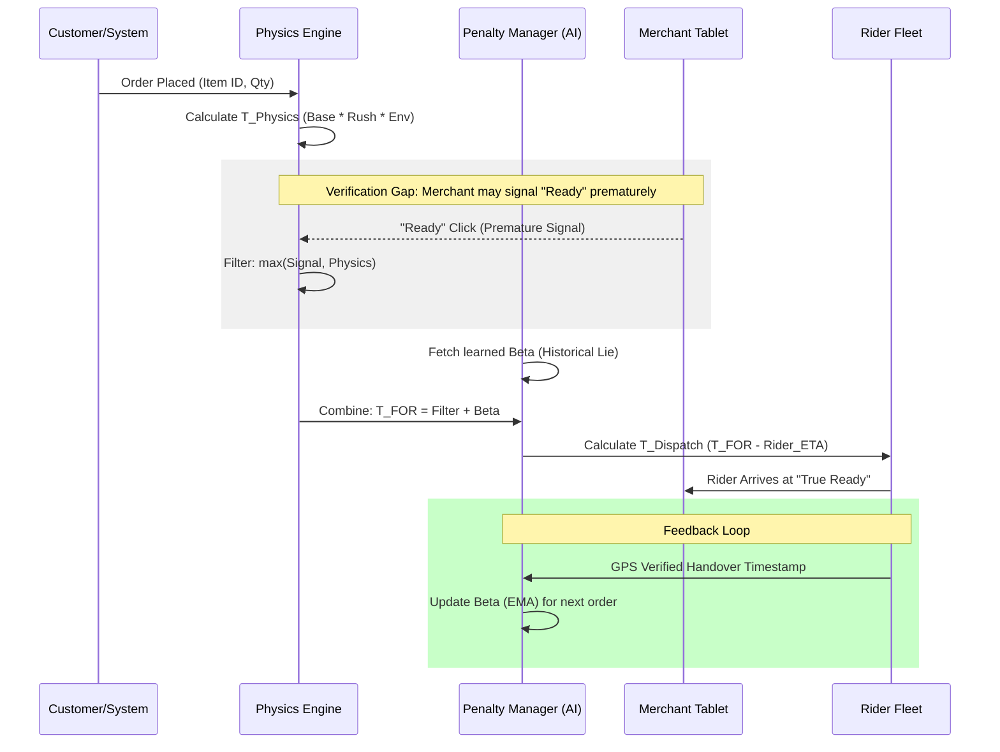

# AI-First Precision Dispatch & Signal De-noising (TruthLink)

## Objective

To eliminate **Rider Wait Waste (RWW)** by treating merchant manual signals as "unreliable sensors" and using GPS-verified handovers as the "Ground Truth."

---

## 1. Relational Data Schema

The system is designed with a normalized schema to allow for item-level physics and merchant-level behavioral modeling.

### A. Merchant Registry (`merchants.csv`)

* `merchant_id`: Unique Identifier (Primary Key).
* `reliability_index`: (0.0–1.0) Historical trust score based on signal accuracy.
* `beta_tod`: Time-of-Day Bias (matrix of average “lying” minutes per hour).
* `capacity_tier`: Small, Medium, or Large (Cloud Kitchen).

### B. Menu Physics (`menu_items.csv`)

* `item_id`: Unique Identifier.
* `merchant_id`: Foreign Key.
* `p_base`: Base Preparation Time (minutes) in a zero-rush environment.
* `min_limit`: Physical minimum time required to safely cook the item.

### C. Environmental Context (`calendar.csv`)

* `date`: YYYY-MM-DD.
* `is_holiday`: Boolean (Trigger for environmental multipliers).
* `weather_factor`: Multiplier for rain/storm kitchen staffing delays.

### D. Truth Log (`orders.csv`)

* `ready_click`: Manual merchant signal timestamp.
* `gps_at_fence`: Rider arrival at 50m geofence timestamp.
* `actual_handover`: GPS-verified departure timestamp (Ground Truth).

---

## 2. Mathematical Framework

### A. Predicted Food-On-Ready ($T_{FOR}$)

Predicts the exact moment the order is ready for pickup by overriding dishonest manual signals with a physical "floor."

$$T_{FOR} = \max(T_{Signal}, T_{Physics}) + \beta_{TOD}$$

Where:

* $T_{Physics} = P_{base} \times C_{rush} \times M_{env}$
* If $T_{Signal} < T_{Physics}$, the AI considers the merchant signal "noisy" and defaults to the physical limit.

### B. Signal Integrity Score ($\phi$)

Quantifies merchant honesty for auditing and ranking.

$$\phi = \frac{T_{Actual\_Handover} - T_{Ready\_Click}}{P_{base}}$$

* If $\phi > 0.3$, the merchant is flagged for **Signal Fraud**, triggering penalty increases.

### C. Self-Healing Penalty ($\beta_{pen}$)

Uses an **Exponential Moving Average (EMA)** to update merchant behavior in real-time.

$$\beta_{pen(new)} = (1 - \alpha) \cdot \beta_{pen(old)} + \alpha \cdot \text{Current\_Signal\_Gap}$$

*(Learning rate $\alpha$ typically set to 0.2 to balance historical data with recent trends.)*

### D. Precision Dispatch Trigger ($T_{Dispatch}$)

$$T_{Dispatch} = T_{FOR} - (T_{Travel} \times \eta_{rider})$$

* $\eta_{rider}$: Efficiency coefficient (e.g., $0.9$ for high-speed riders, $1.1$ for complex mall parking zones).

---

## 3. Operational Workflow

1. **Ingestion:** Identify the most complex item and calculate the current kitchen congestion factor ($C_{rush}$).
2. **Calibration:** Inject the merchant's specific Time-of-Day bias ($\beta_{TOD}$).
3. **Synchronization:** Calculate $T_{Dispatch}$. If $T_{Dispatch} > \text{Current Time}$, the dispatch is "held" to prevent idle waiting.
4. **Verification:** Compare the Merchant’s “Ready Click” against the rider’s actual GPS arrival at the geofence.
5. **Feedback Loop:** Post-handover, the EMA updates the `reliability_index` to refine the next dispatch.

---

## 4. Workflow Diagram

---

## 5. Expected Impact

| Metric | Target | Description |
| --- | --- | --- |
| **Rider Wait Waste** | **-70%** | Drastic reduction in idling through JIT (Just-In-Time) dispatching. |
| **Signal Reliability** | **+90%** | Filtered inputs ensure the dispatcher operates on "Truth," not "Claims." |
| **SLA Compliance** | **+25%** | Honest ETAs reduce "false-start" alerts for customers. |
| **Merchant Honesty** | **High** | Gamification/Penalties incentivize clicking "Ready" only when the bag is sealed. |

---

## 6. Scalability & Robustness

* **Small Scale:** Uses EMA for incremental learning; works even with low order volume.
* **Large Scale:** Vectorized processing (Pandas/NumPy) allows handling 100k+ concurrent orders.
* **Fail-safe:** If GPS signals fail, the system defaults to $T_{Physics} + \text{Historical Mean Beta}$.

---

**Author:** Krunal Kadam

**Email:** krunalkadam0703@gmail.com

---
